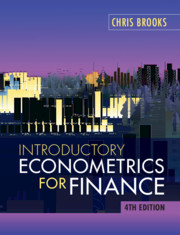

# Introductory Econometrics for Finance
Source code for Introductory Econometrics for Finance by Chris Brooks.

---------------

#### Useful resources
Location of the [Python source code](https://www.cambridge.org/highereducation/books/introductory-econometrics-for-finance/75E9C608EA95A3AD87FB3BC683B9EBBF/resources/student-resources/10387D9567DA978F7E5DC6565F57F04F/python-code/8BB3DBAE944CBED5FB8F1933281B2FDE)

----

